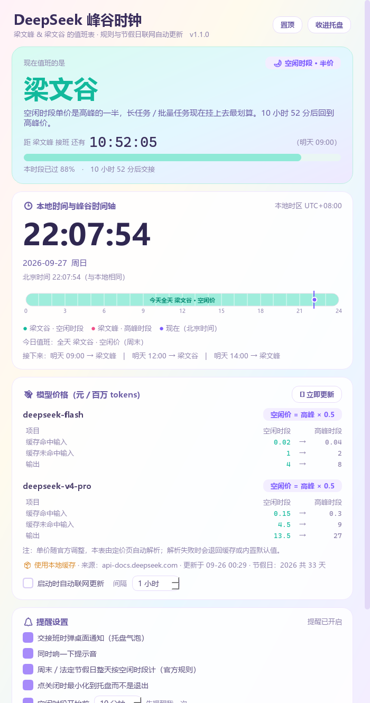

# DeepSeek 峰谷时钟 · DeepseekPeakClock

**当前版本 v1.1.0** ｜ 浅色多巴胺风格的 PyQt5 桌面小工具，替你盯住 DeepSeek API 的
**高峰 / 空闲（错峰）时段**：

```
高峰时段  ->  「梁文峰」值班（标准价）
空闲时段  ->  「梁文谷」值班（价格为高峰的一半）
```

```
⏰ 大字时钟      本地时间 + 北京时间 + 日期星期 + 时区
🎨 实时值班      当前是峰是谷一眼看清，整卡配色跟着状态切换
⏳ 倒计时        本时段还剩多久 + 时段进度条
📊 24 小时轴     高峰区间高亮，带「现在」游标（跨时区时另画一根本地游标）
🔔 交接班提醒    托盘常驻、桌面通知、可选提示音、提前 N 分钟预告
💰 价格对照表    空闲价 / 高峰价双列并排，模型与价格随官方页面自动更新
🔄 规则自动更新  三级兜底：联网结果 -> 本地缓存 -> 内置默认值
```

---

## 界面预览



截图是**空闲时段**的样子：值班大字卡是薄荷绿（梁文谷），
切换到高峰时段会整体变成珊瑚粉（梁文峰）。

---

## 一、安装与运行

**不想装 Python**：到 [Releases](../../releases) 下载 `DeepseekPeakClock.exe`，
单文件免安装，双击即用（托盘常驻，关窗口只是收进托盘，右键托盘图标可以退出）。

想改代码就跑源码：

```powershell
pip install -r requirements.txt
python main.py
```

其他参数：

```powershell
python main.py --selftest   # 核心层 + 界面层自检，不弹窗
python main.py --fetch      # 只测联网获取，打印拿到的规则和价格
```

---

## 二、计费规则从哪来

以官方定价页为准：

> 北京时间**周一至周五（不含中国法定节假日）9:00-12:00、14:00-18:00 为高峰时段**；
> 其余时段，包括**周末及中国法定节假日全天，均为空闲时段**。
> 空闲时段价格为高峰时段价格的一半。

（2026-08-17 起 DeepSeek 启用峰谷定价，取代了早期「每日 00:30-08:30 错峰优惠」的方案。）

**规则不写死在代码里。** 程序启动后会在后台联网获取并缓存到本地：

| 内容 | 来源 |
| --- | --- |
| 峰谷时段 + 模型价格 | `https://api-docs.deepseek.com/zh-cn/quick_start/pricing` |
| 中国法定节假日 | `https://timor.tech/api/holiday/year/<年>`（备用：`holiday-cn`） |

三级兜底：**联网结果 -> 本地磁盘缓存 -> 内置默认值**。
界面上会显示当前用的是哪一级、什么时候更新的，也可以点「🔄 立即更新」。

> 官方调整价格或时段后，程序下次联网就会自动跟上；解析不出来时会保留上一次的结果，
> 不会把界面搞崩。

---

## 三、界面怎么用

打开就是一个竖排卡片：

```
┌─ 标题栏 ─────────────────────────────────────────┐
│ DeepSeek 峰谷时钟        [⚡ 现在 梁文峰]  [📌 置顶] │
├─ 值班大字卡（整卡配色随峰谷切换）─────────────────┤
│   梁文峰 / 梁文谷        倒计时 02:14:37          │
│   今日值班：高峰 09:00-12:00、14:00-18:00 …       │
│   接下来：今天 18:00 → 梁文谷 | 明天 09:00 → …    │
├─ 时钟卡 ─────────────────────────────────────────┤
│   14:23:05           北京时间 14:23:05            │
│   2026-09-23 周三    时区 UTC+8                   │
│   ▓▓▓▓▓▓░░░░░░░░  24 小时时间轴（高峰高亮）        │
├─ 价格对照表 ─────────────────────────────────────┤
│   deepseek-flash     项目   空闲   高峰           │
│                      输出    4.0 →  8.0           │
├─ 提醒设置 ───────────────────────────────────────┤
│   ☑ 交接班时弹桌面通知   ☑ 最小化到托盘            │
│   ☑ 空闲开始前 [10 分钟] 先提醒我一次              │
└──────────────────────────────────────────────────┘
```

* **托盘**：左键单击切换显示 / 隐藏，右键出菜单（显示主窗口、窗口置顶、立即更新、测试提醒、退出）
* **关闭按钮**：默认收进托盘继续提醒；取消勾选「最小化到托盘」后就是真的退出
* **时间轴**：横轴固定按**北京时间**画，所以人在别的时区也能一眼看出官网的高峰区间；
  本地时区和北京时间不一致时会额外画一根黄色游标

---

## 四、目录结构

```
deepseek-peak-clock/
├── main.py                 入口（自检调度、异常兜底、图标与任务栏分组）
├── theme.py                配色与 QSS
├── build_exe.py            一键打包单文件 exe
├── 启动.vbs                无控制台窗口启动器
├── requirements.txt
├── LICENSE                 MIT
├── assets/                 图标资源（app.ico / app.png）
├── docs/screenshot.png     README 里的界面截图
├── selftest_core.py        核心层自检
├── selftest_ui.py          界面层自检
├── tools/
│   └── make_icon.py        生成 assets/app.ico
├── core/                   与界面无关的核心逻辑
│   ├── paths.py            路径解析（源码运行 / exe 运行都适用）
│   ├── config.py           常量、数据源地址、内置兜底规则与价格
│   ├── feed.py             联网获取与解析（定价页 / 节假日）
│   ├── rules.py            生效规则 ACTIVE、本地缓存读写
│   └── engine.py           峰谷判定引擎（纯时间计算）
└── ui/
    ├── widgets.py          托盘图标、卡片、24 小时时间轴
    ├── fetch.py            后台联网线程
    └── window.py           主窗口
```

`core/` 完全不依赖 Qt，可以 `python selftest_core.py` 单独验证排程逻辑。

---

## 五、几个实现上的坑

写的时候踩过、已经处理掉的：

* **连续假期要先把空闲区间合并。** 国庆 + 周末会让空闲段横跨十来天，
  不合并的话交接班预告会在中间的 00:00 误报一次状态切换。
* **合并后当前段可能被窗口左边缘截断。** 所以定位当前段时窗口要按需往前翻倍扩展，
  不然进度条会把起点算错、倒计时也不对。
* **恢复设置时不能边改边存。** `setChecked` / `setValue` 会触发槽函数立刻回写设置，
  把还没读到的那几项覆盖掉；`_restore_settings()` 全程盖住 `_loading` 开关来避免。
* **PyQt5 的槽函数里抛异常会直接 abort 进程。** `main.py` 装了自定义
  `sys.excepthook` / `threading.excepthook`，异常写进 `crash.log` 而不是闪退。
* **打包后 `__file__` 指向临时解包目录。** 缓存和图标统一走 `core/paths.py`，
  保证 exe 也能正常读写。

---

## 六、打包成单个 exe

```powershell
pip install pyinstaller
python build_exe.py
```

产物是 `dist\DeepseekPeakClock.exe`，**单文件、免安装、带图标**。
打包参数都写在 `build_exe.py` 里：

* `CONDA_DLLS`：conda 把 OpenSSL 放在 `Library\bin`，不带上的话
  打出来的 exe 一联网（https）就崩
* `--add-data assets`：图标；`selftest_*.py` 也一起带上，方便直接验证打包结果
* `--windowed`：GUI 子系统，不会弹控制台

```powershell
# 打包后没有控制台，把自检结果写进文件来验证
.\dist\DeepseekPeakClock.exe --selftest --selftest-out=selftest.txt

# 启动即退出时用它排查（控制台 + bootloader 日志）
python build_exe.py --debug
```

---

## 七、常见问题

**Q：规则 / 价格是实时的吗？**
不是实时，是启动时拉一次、之后按设置间隔（默认 6 小时）再拉。想立刻刷新点「🔄 立即更新」。

**Q：断网了还能用吗？**
能。会退回本地缓存；没有缓存就用内置默认值，界面上会标明当前用的是哪一级。

**Q：我的时区和北京时间不一样，显示会不会错？**
不会。判定始终按北京时间算，时钟卡同时显示本地时间和北京时间，时间轴也按北京时间画。

**Q：为什么叫梁文峰 / 梁文谷？**
谐音梗：峰 = 高峰时段，谷 = 空闲时段，纯属好记。

**Q：关掉窗口怎么退不出去？**
默认是收进托盘继续提醒。右键托盘图标选「退出」，或取消勾选「最小化到托盘」。

---

## 八、许可

[MIT](LICENSE)。核心前提：**价格与峰谷时段以
[DeepSeek 官方定价页](https://api-docs.deepseek.com/zh-cn/quick_start/pricing) 为准**，
本工具只是把它画出来并按时提醒，如与官网不一致请以官网为准。
